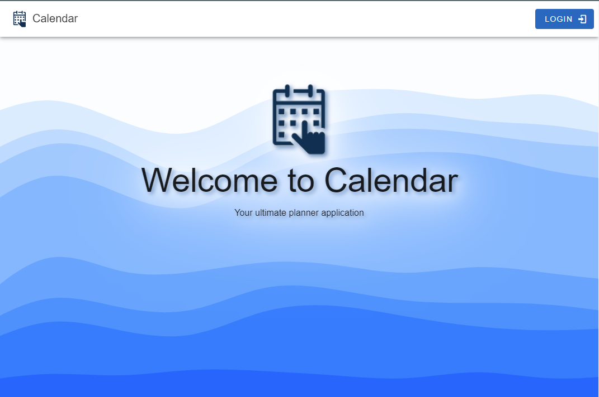
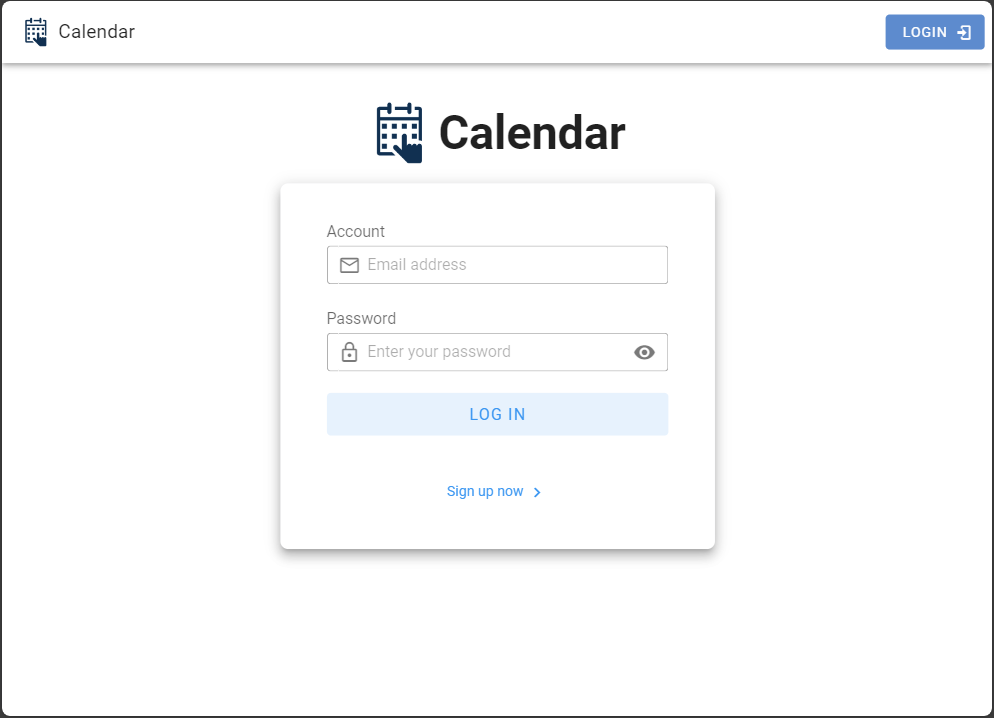
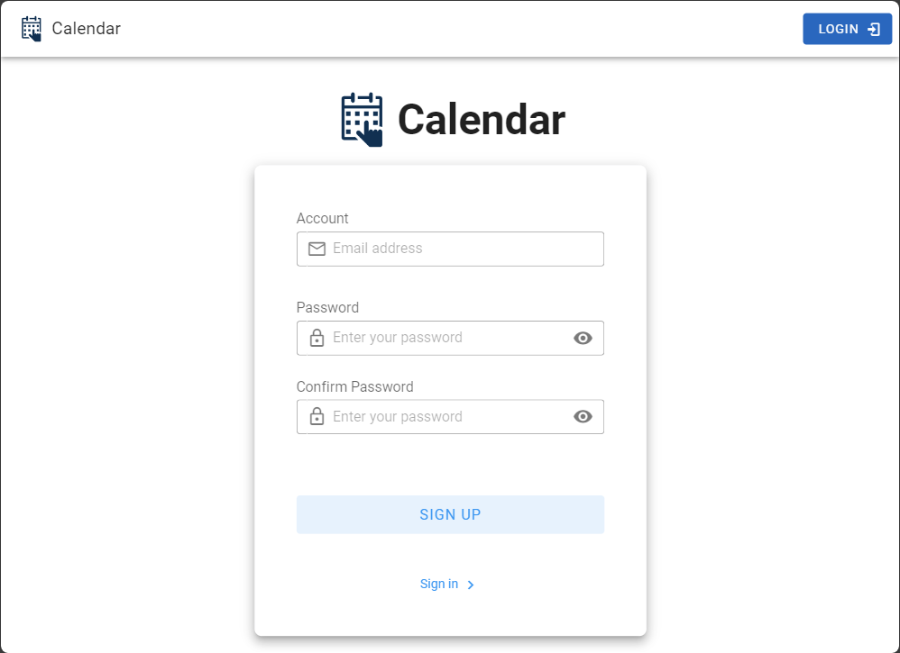
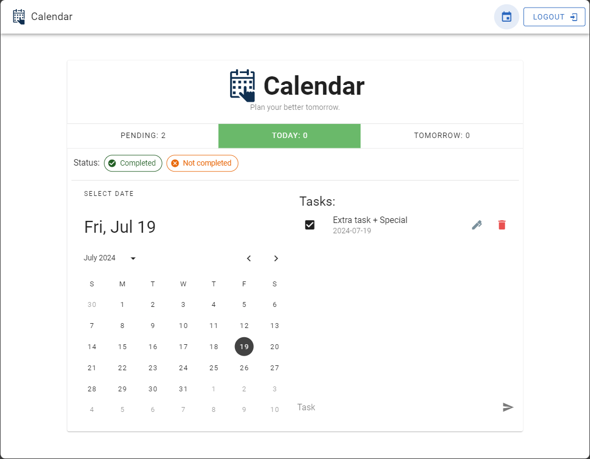
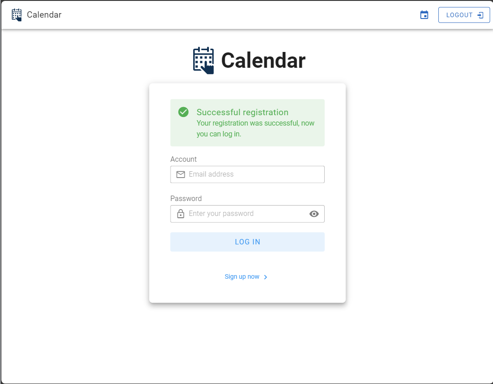
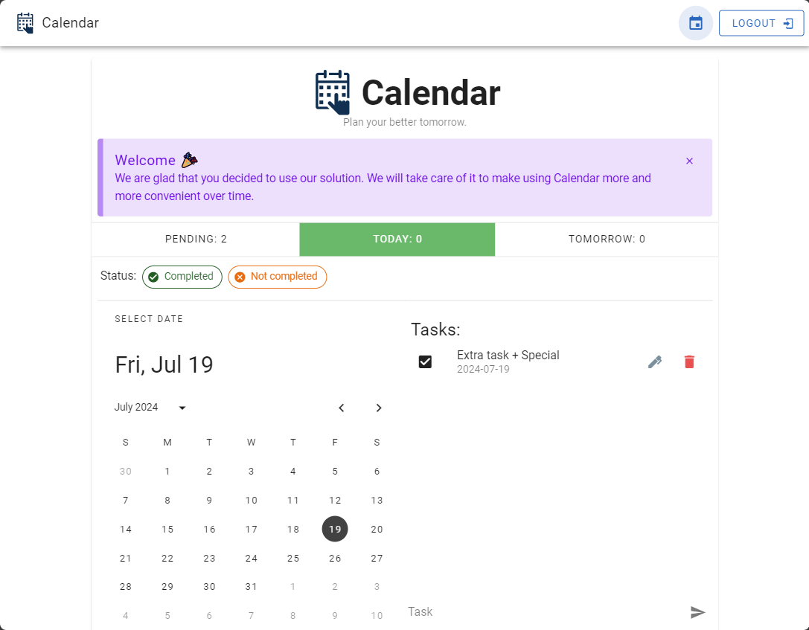

# CalendarTodoList

## Requirements

- MS SQL Server

## Development

### Add connection string

In Visual Studio 2022, right-click on `CalendarTodoList.Server` then select `Manage User Secrets` and add a connection string as in the example.

```json
// secrets.json
{
  "ConnectionStrings": {
    "Default": "Server=localhost\\SQLEXPRESS;Database=CalendarTodoList;Trusted_Connection=True;TrustServerCertificate=True;"
  }
}
```

## Overview

### Normal




### New user



